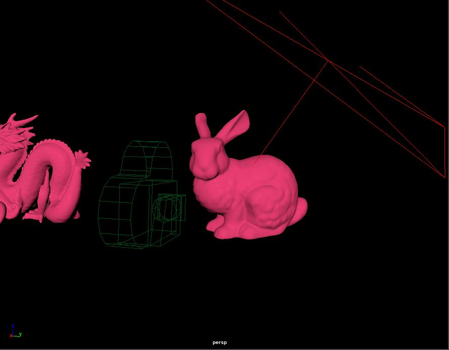
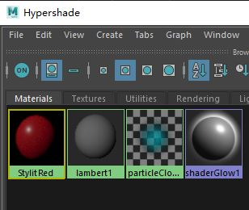
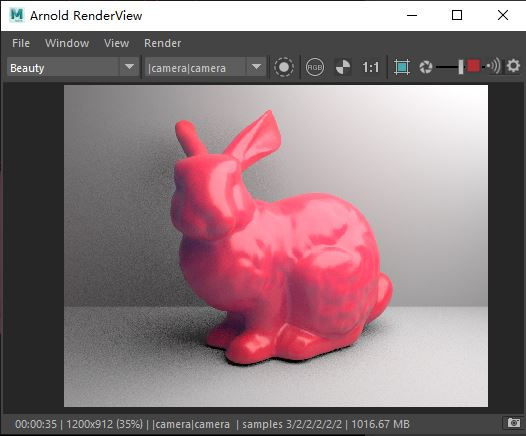
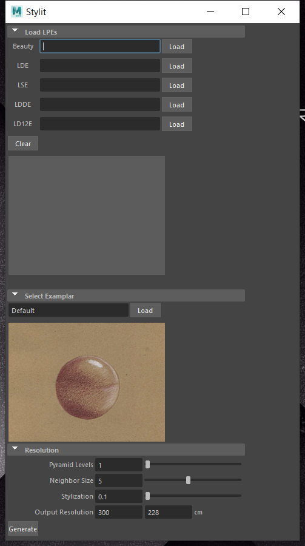
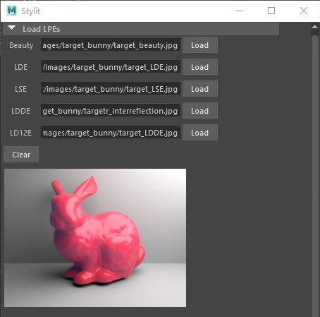
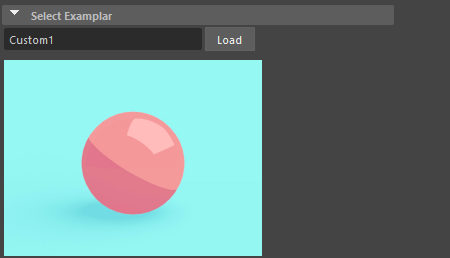
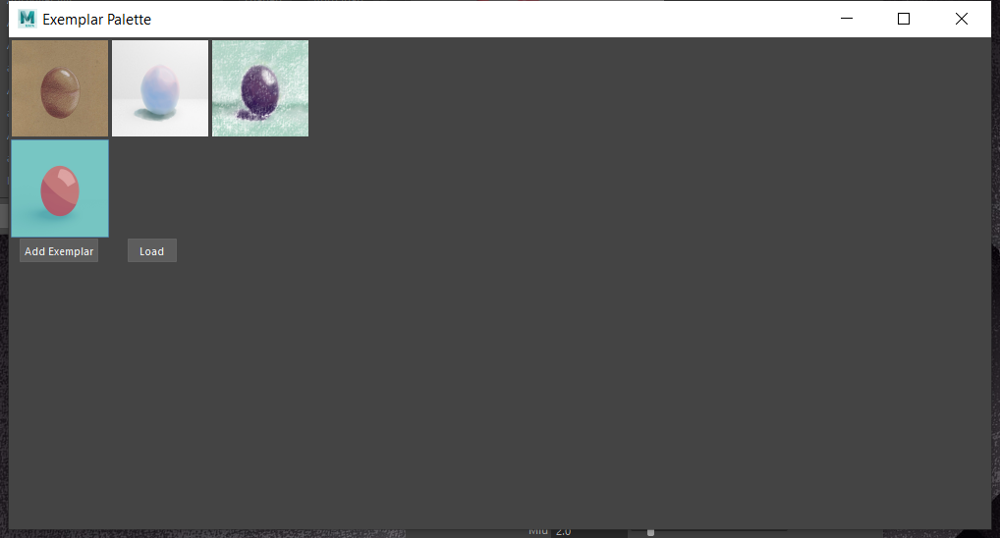
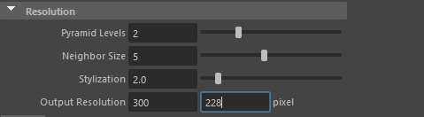
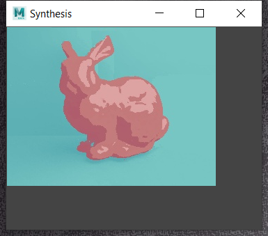

# Stylit
We developed an authoring tool that can reflect the designed visual effect to the model, based on the paper *Stylit: illumination-guided example-based stylization of  3d renderings* [Fiˇser et al. 2016]. The tool can provide an artistic visual effect for 3D models, including complex objects like landscape, with very low cost, especially suitable for independent developers. Users just need to render five LPE images and draw a very simple “sphere on the table” scene, then a synthesized artistic image with adjustable resolution and size can be generated.  

## Workflow
### STEP1: Gnererate LPEs
1. Open the default ‘scene.mb’  
2. Load your custom 3D scene  

3. Open hypershade, and assign the  “StylitRed” material to the models  
 
4. Open Arnold and you will see the below scene  
5. Render and save the five LPE images in Arnold by changing the AOVs  
 

### STEP2: Stylization
6. Open Stylit Plugin  
 
7. In ‘Load LPEs’ section, load the five LPEs you just created in STEP1  
 
8. In ‘select Exemplar’ section, you have two options:  
  
      - select a default exemplar  
      - create your own exemplar using the below image we provided  
       
9. Load the default or custom exemplar to the plugin by clicking on ‘Load’  
 
10. In ‘Resolution’ section, modify the parameters  
 
11. Finally, click Generate, it will show the result in a few minutes and also automatically save the output to the same directory as the beauty LPE image.  
  
